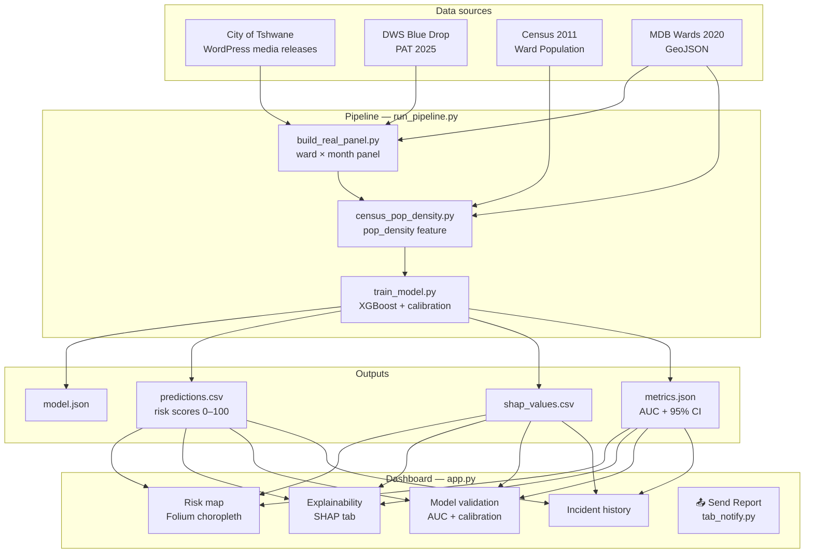

# METSI-EWS for City of Tshwane

An end-to-end ML early-warning system that predicts water infrastructure failure risk at ward level across all 107 City of Tshwane wards, three months in advance. Built as a BSc IT capstone project at Richfield Graduate Institute of Technology (Emerging Technology / Data Science specialisation) and designed as a civic-tech pitch for City of Tshwane stakeholders and prospective data partners.

[] (https://github.com/Terrence-dev247/METSI-EWS/actions/workflows/ci.yml)

---

## Quick start

```bash
pip install -r requirements.txt
python run_pipeline.py          # builds panel → adds features → trains model → opens dashboard
```

One command. The dashboard opens automatically when training finishes.

---

## Architecture



---

## Pipeline flowchart

```mermaid
flowchart LR
    P1[pull_media_releases] --> P2[dedupe_media_releases]
    P2 --> P3[classify_media_releases]
    P3 --> P4[build_final_incidents]
    P4 --> P5[finalize_geocoding]
    P5 --> P6[join_incidents_to_wards]
    P6 --> P7[build_combined_dataset]
    P7 --> P8[define_target]
    P8 --> P9[build_real_panel]
    P9 --> P10[census_pop_density]
    P10 --> P11[train_model]
    P11 --> P12([Dashboard])

    style P9 fill:#E6F1FB,stroke:#185FA5
    style P10 fill:#E6F1FB,stroke:#185FA5
    style P11 fill:#E6F1FB,stroke:#185FA5
    style P12 fill:#EAF3DE,stroke:#3B6D11
```



Steps P1–P8 are one-time historical data collection. **P9–P11 run on every `python run_pipeline.py` call.**

---

## Folder structure

```
METSI-EWS/
├── run_pipeline.py              Single entry point — runs P9 → P10 → P11 → opens dashboard
├── config.py                    All tunable constants (FORECAST_WINDOW, FEATURES, split ratios …)
├── app.py                       Streamlit dashboard (6 tabs)
├── notify.py                    Email utility — composes and sends ward-risk report via SMTP
├── tab_notify.py                Streamlit "Send Report" tab (imported by app.py)
├── .env.example                 SMTP credentials template — copy to .env and fill in
├── requirements.txt
├── tests/
│   ├── test_config.py           Config sanity checks (no I/O, always fast)
│   ├── test_pipeline.py         Panel structure tests (skipped if data absent)
│   └── test_model.py            Model output tests (skipped if model absent)
├── .github/workflows/ci.yml     GitHub Actions — runs tests on every push
├── data/
│   ├── raw/                     Untouched scrape outputs (never hand-edited)
│   ├── interim/                 Intermediate pipeline stages
│   ├── processed/               Model-ready datasets
│   │   ├── tshwane_real_panel.csv
│   │   └── tshwane_water_incidents_labeled.csv
│   ├── model_outputs/
│   │   ├── real/                model.json · predictions.csv · shap_values.csv · metrics.json
│   │   └── synthetic/           Synthetic sanity-check baseline (unchanged by run_pipeline.py)
│   └── qa/                      Ward geocoding spot-check images
├── src/
│   ├── pipeline/                Historical data collection scripts (P1–P8)
│   ├── modeling/                train_model.py · generate_synthetic_data.py
│   └── utils/                   One-off diagnostics and patch scripts
└── docs/
    ├── research_notes/          Per-incident classification reasoning
    └── logs/                    Captured terminal output from past runs
```

---

## Features

| Feature | Type | SHAP | Description |
|---|---|---|---|
| `pop_density` | Demographic | 1.04 | Persons/km² (Census 2011, Stats SA ward-level totals; wards 106–107 metro-avg fallback) |
| `area_km2` | Structural | 0.97 | Ward area larger wards have more pipe exposure |
| `wss_bdrr` | Regulatory | 0.46 | Blue Drop Risk Rating (DWS PAT 2025); 14 confirmed + 93 nearest-WTW |
| `is_known_chokepoint` | Structural | 0.43 | Binary flag for TSH_58 (Bosman/CBD) and TSH_80 |
| `calendar_month` | Temporal | 0.42 | Month-of-year seasonality proxy |
| `months_since_last_failure` | Temporal | 0.29 | Recency of last confirmed failure in this ward |
| `cumulative_failures_to_date` | Temporal | 0.14 | Running failure count per ward up to current month |
| `is_dry_season` | Temporal | 0.06 | May–September = 1 |
| `nrw_pct` | Regulatory | 0.00 | Non-revenue water % (municipal constant, zero variance pending ward-level data) |
| `failure_count_this_month` | Temporal | 0.00 | Count of failures in the current month |
| `failure_occurred_this_month` | Temporal | 0.00 | Binary version of above |

SHAP values are mean absolute SHAP across the test set (Dec 2024 – Mar 2026).

**Pending features** (data requests outstanding): IMQS pipe age / material / condition, OurPower ward-level outage frequency, confirmed `wss_bdrr` for 93 nearest-WTW wards.

---

## Model evaluation

### Performance

| Metric | Value |
|---|---|
| ROC-AUC | **0.723** |
| 95% CI (bootstrap, n=1000) | [0.65, 0.80] |
| PR-AUC | 0.024 |
| Brier score (calibrated) | 0.065 |
| Test positives | 14 of 1,712 rows |
| Positive rate | 0.96% |

### Temporal split

| Split | Period | Rows | Positives |
|---|---|---|---|
| Train | Aug 2019 – Nov 2023 | 5,564 | 46 |
| Validation | Dec 2023 – Nov 2024 | 1,284 | 22 |
| Test | Dec 2024 – Mar 2026 | 1,712 | 14 |

**No future leakage.** Split is strictly chronological — never random.

### Calibration

Raw XGBoost probabilities are post-hoc calibrated using isotonic regression fitted on the validation set. Calibrated probabilities are used for Brier score; raw probabilities are used for AUC ranking and SHAP to preserve consistency.

### Known ceiling

The binding constraint is data sparsity (14 test positives), not hyperparameter tuning. The 95% CI spans ~15 percentage points expected at this sample size. Adding IMQS pipe condition data is the highest-leverage single action.

---

## Dataset

- **50 incidents** manually collected and classified from City of Tshwane WordPress media releases (Aug 2019 – Mar 2026)
- **32 target-positive** (Tshwane-owned infrastructure failures, geocodable to a ward)
- **82 positive ward-months** after 3-month forward-window labelling across 8,560 total ward-months (107 wards × 80 months)
- **Excluded**: Rand Water external bulk supply incidents (Zuikerbosch, Palmiet, Mapleton, B8 pipeline), vandalism, weather events

---

## Methodology notes

- **Chronological split only** random splits leak temporal autocorrelation and overstate performance.
- **3-month forward label** `failure_within_3mo = 1` if any target-positive incident occurs in the ward within the next 3 months of the current row's month.
- **Class imbalance via `scale_pos_weight`** not oversampling, which would distort the test set's real-world rarity.
- **`category` ≠ `status`** — `category` describes what happened; `status` flags ownership/location. An `unplanned_burst` on Rand Water infrastructure looks identical to a Tshwane burst in `category` always use the status override for exclusions, never rely on category alone.
- **TSH_58 is the validation anchor** the same 1000mm HDPE trunk line at Bosman Station burst in 2019, 2025, and 2026; the model independently surfaces it as a top-ranked ward every run.
- **Body-aware classification** naive substring matching on `"planned"` false-positives inside `"unplanned"`. `classify_media_releases.py` uses word-boundary regex on the full post body.
- **Multi-ward geocodable pattern** `scope="multi_ward"` with no coordinates silently drops a confirmed incident. Always check whether the body text names a specific repair site before accepting a multi-ward scope tag as final.

---

## Configuration

All tunable constants live in `config.py` at the project root. Import anywhere:

```python
from config import cfg

cfg.FORECAST_WINDOW   # 3
cfg.N_WARDS           # 107
cfg.FEATURES          # list of 11 feature names
cfg.TRAIN_QUANTILE    # 0.65
```

---

## Running tests

```bash
pip install pytest pytest-cov
pytest tests/ -v
```

`test_config.py` runs with no data. `test_pipeline.py` and `test_model.py` skip automatically if their data files are absent safe to run in CI before the pipeline has been executed.

---

## Send Report

The dashboard includes a **📤 Send Report** tab that composes and sends a ward-risk summary email to City of Tshwane contacts or data partners. No external dependencies stdlib `smtplib` only.

**Setup:**

```bash
cp .env.example .env        # fill in your Gmail App Password
pip install python-dotenv   # optional — credentials can also be entered in the UI
```

**Environment variables:**

| Variable | Description |
|---|---|
| `METSI_SMTP_HOST` | SMTP host (default: `smtp.gmail.com`) |
| `METSI_SMTP_PORT` | SMTP port (default: `587`) |
| `METSI_SMTP_USER` | Sender email address |
| `METSI_SMTP_PASS` | Gmail App Password (not your account password) |

Gmail App Passwords require 2-Step Verification to be enabled: https://myaccount.google.com/apppasswords

The tab pre-populates `datahub@tshwane.gov.za` as the default recipient. Risk threshold and maximum ward count are adjustable. A plain-text preview is available before sending.

---

## Pending data requests

| Dataset | Contact | Status |
|---|---|---|
| IMQS Pipe Priority Programme | <datahub@tshwane.gov.za> | Awaiting response |
| OurPower outage API | <info@ourpower.co.za> | Awaiting response |
| StatsSA Census 2011 SAL | <info@statssa.gov.za> | Requested |

---

## Limitations

- **14 test positives** AUC has a wide CI until more confirmed incidents are added.
- `wss_bdrr` for 93 wards is estimated via nearest water treatment works not confirmed ward-level scores.
- `pop_density` uses Statistics South Africa Census 2011 ward-level population totals (WingArc/SuperCROSS release v1.3). Tshwane total: 2,921,486 (105 wards); wards 106–107 use metro-average fallback (27,824). Values are ~24% lower than WorldPop 2020 raster estimates (3.8M) expected given 9-year population growth; documented limitation.
- Ward tags are suburb-centroid approximations acceptable for model training, not for precision boundary claims.
